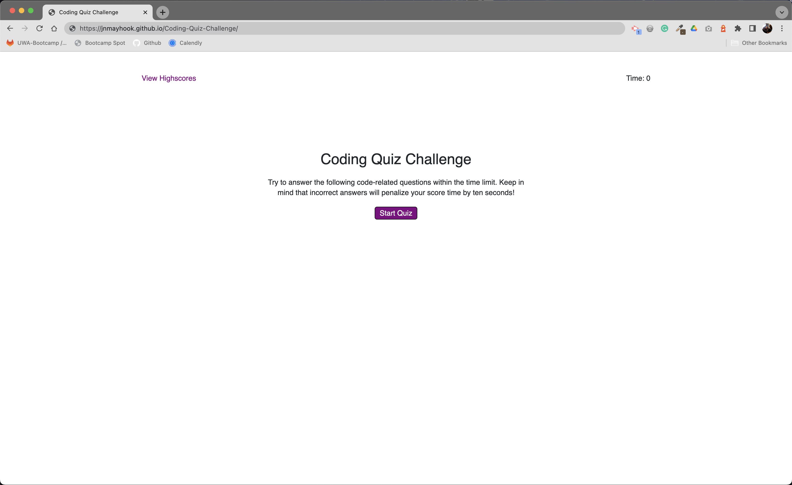

# Coding Quiz Challenge

## Description
A front-end application that presents a user with multiple-choice questions about JavaScript, keeps score and has a time limit.  Once the user clicks the start quiz button, the timer begins, and the final score is displayed when all the questions are answered.  The user is then presented with input fields to enter their initials, which are stored in local storage along with their score and viewable on a scoreboard.  The page can be refreshed, and the scores remain on the leaderboard.  

[Click here for the deployed app on GitHub.](https://jnmayhook.github.io/Coding-Quiz-Challenge/)


## Technologies
- HTML5
- CSS/Bootstrap Framework
- Javascript/Node.js


## Installation Instructions
```
npm i
```


## Usage Instructions
Click the start quiz button and answer the questions as they appear.  When the quiz is complete, the final score will be displayed; enter your initials and see where you rank on the leaderboard.  Good luck!


## Screenshots



## License
This project is MIT licensed.


## Questions? 
Please contact me: 

GitHub: [@jnmayhook](https://github.com/jnmayhook)
Email: [jnmayhook@gmail.com](mailto:jnmayhook@gmail.com)

